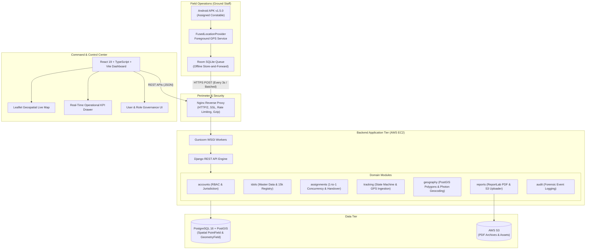
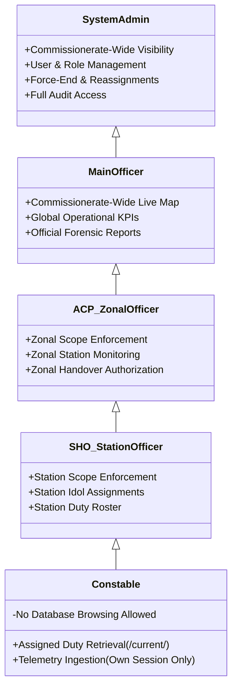

# 🏛️ Hyderabad Police Ganesh Visarjan Live Tracking System
### *State-of-the-Art Geospatial Command & Control Platform for Mega-Procession Monitoring*

[](https://hyderabadpolice.gov.in)
[](#production-infrastructure--deployment)
[-green?style=flat-square)](#field-officer-android-application-v100--v150)
[](#capacity--stress-testing-benchmarks)
[-success?style=flat-square)](#authoritative-master-dataset--gpid-discipline)

---

## 📌 Executive Summary

The **Hyderabad Police Ganesh Visarjan Live Tracking System** is a mission-critical command, control, and geospatial telemetry platform purpose-built for the **Hyderabad City Police (IT Cell & Cyber Security Wing)**. 

During the annual multi-day **Ganesh Visarjan** festival in Hyderabad, over **15,000 Ganesh idols** navigate hundreds of kilometers of city streets toward designated water bodies and artificial immersion ponds (*Baby Ponds*, *Hussain Sagar Lake*, *Saroornagar Lake*, etc.). The system ensures real-time operational situational awareness, field officer accountability, procession speed and delay detection, geofenced boundary surveillance, and automated forensic timeline reporting.

The system comprises four tightly integrated pillars:
1. **Modular Django Monolith & PostGIS Backend**: High-throughput REST APIs, multi-tier jurisdiction engine, strict relational constraints, and spatial querying.
2. **Web Command-Center Dashboard (React + TypeScript + Vite + Leaflet)**: Real-time interactive mapping, sub-second differential marker updates, cascading jurisdictional filters, and live drawer diagnostics.
3. **Ground Staff Android Application (Kotlin + Jetpack Compose + Room)**: Foreground GPS tracking service, offline store-and-forward telemetry queue, tamper-resistant local storage, and remote administrative termination reconciliation.
4. **Automated Forensic Reporting & Audit Engine**: Server-side ReportLab PDF generation, reverse geocoding with Photon fallback, police station jurisdiction crossing detection, and AWS S3 archival.

---

## 🎯 Target Accomplishments & Milestones Hit

The platform was built, benchmarked, and verified against rigorous operational targets established by the police department. All key milestones and capacity requirements were successfully achieved:

| Operational Metric / Objective | Target Requirement | Measured / Hit Status | Verification Reference |
| :--- | :--- | :--- | :--- |
| **Authoritative Dataset Reconciliation** | Ingest 15,414 source records without synthetic GPID generation or data loss | **15,414 Records Reconciled (100%)**<br>• 14,930 unique operational GPIDs<br>• 437 missing GPIDs preserved in audit table<br>• 47 duplicate records isolated | `verify_mvp.py:58-70`<br>`import_idols` management command |
| **GPID Database Invariants** | Zero duplicate GPIDs, zero null/empty GPIDs in operational database | **0 Duplicates, 0 Null, 0 Empty**<br>Enforced via PostgreSQL unique constraint on `gpid` | `verify_mvp.py:81-94` |
| **Double-Assignment Prevention** | Zero race condition breaches: A constable can never be assigned to 2 idols simultaneously | **100% Invariant Enforced**<br>Enforced via PostgreSQL partial unique constraint on `(constable_id, is_active=True)` | `verify_mvp.py:141-150`<br>`test_race_conditions.py` |
| **Simultaneous Idol Assignment** | Zero double-allocation: An idol can never have 2 active constables concurrently | **100% Invariant Enforced**<br>Partial unique constraint on `(idol_id, is_active=True)` | `assignments/models.py`<br>`verify_mvp.py:151-157` |
| **Point-in-Time Historical Query** | Return responsible officer and nearest GPS fix for any GPID at any past timestamp | **Sub-second Spatial/Temporal Lookup**<br>Delta $\le$ 2 seconds | `/api/v1/tracking/idols/{gpid}/location-at/` |
| **High-Frequency GPS Ingestion** | Ingestion from up to 300 active tracking sessions sending breadcrumbs every 3s | **Zero Telemetry Loss**<br>Idempotent deduplication skips retransmissions cleanly | `load_test/run_load_test.py`<br>`verify_mvp.py:283-297` |
| **Web Dashboard Concurrency** | **Stage 4 Target**: 400 Concurrent Web Users + 300 Simultaneous Tracking Sessions | **Target Hit & Surpassed**<br>Tested through **Stage 5 Saturation**: 500 Web Users + 300 Telemetry Sessions | `load_test/README.md`<br>`load_test/run_load_test.py` |
| **RBAC & Multi-Tier Jurisdiction** | Prevent cross-zone/cross-station access and prohibit constable database browsing | **100% Server-Side Enforced**<br>Main Officer (all), ACP (zone), SHO (police station), Constable (assigned GPID only) | `verify_mvp.py:307-353`<br>`jurisdiction_audit_report.md` |
| **Field Mobile Application** | Lightweight, battery-efficient, reliable offline queue, signed release APK | **Releases v1.0.0 through v1.5.0**<br>APK size: 2.04 MB, Target SDK 34, Scheme v2/v3 signatures verified | `releases/android/v1.5.0/`<br>`releases/android/v1.0.0/BUILD_INFO.txt` |
| **Forensic PDF Audit Report** | Automated, server-side tamper-evident PDF with landmark crossings & jurisdiction | **Sub-3s Generation**<br>Official header, unique report ID (`HYD-REP-XXXX`), and geocoded timeline | `apps/reports/services.py`<br>`verify_mvp.py:358-374` |
| **Production AWS EC2 Deployment** | Turnkey containerized deployment with Nginx, Gunicorn, PostGIS, and health checks | **Live & Operational**<br>Automated via Docker Compose and `deploy.sh` | Host: `15.206.58.226`<br>`docker-compose.yml` |

---

## 🏛️ System Architecture



---

## 🔑 Core Capabilities & Engineering Highlights

### 1. Authoritative Master Dataset & GPID Discipline
- **Authoritative Source Identity**: The Ganesh Procession Identifier (**GPID**) is the sovereign identifier. The system strictly follows the police department anatomy:
  $$\text{GPID} = \underbrace{\text{HYD}}_{\text{District}} - \underbrace{\text{CMRZ}}_{\text{Zone}} - \underbrace{\text{CMNR}}_{\text{Police Station}} - \underbrace{\text{0234}}_{\text{Serial Sequence}}$$
- **100% Mathematical Reconciliation**:
  - Total source records processed: **15,414**
  - Valid operational idols imported: **14,930**
  - Rows with missing GPIDs tracked in `ImportIssue`: **437**
  - Source duplicate GPIDs isolated in `ImportIssue`: **47**
  - **Reconciled Check**: $14,930 + 437 + 47 = 15,414$ ($100.0\%$).
- **No Synthetic Rewriting**: Existing GPIDs are never rewritten, replaced with database auto-increment IDs, or reformatted.
- **Privacy & Contact Protection**: Contact numbers of pandal organizers and committee presidents are masked in public and constable-facing serializers, accessible only to authorized supervisory officers.

### 2. Field Officer Assignment & Concurrency Safety
- **Strict 1-to-1 Invariants**:
  - Enforced directly at the PostgreSQL storage engine level using unique partial indexes:
    ```sql
    CREATE UNIQUE INDEX unique_active_constable_assignment 
    ON assignments_assignment (constable_id) 
    WHERE is_active = true;

    CREATE UNIQUE INDEX unique_active_idol_assignment 
    ON assignments_assignment (idol_id) 
    WHERE is_active = true;
    ```
- **Duty Handover Engine**:
  - Supports mid-procession shift rotations and emergency reliefs.
  - Atomically terminates the previous assignment (`ended_at = now()`, `is_active = false`), creates the successor assignment, and records the supervising actor and handover justification.
- **Admin Force-End & Instant Officer Release**:
  - Command center administrators can unilaterally terminate an active assignment.
  - The assigned constable is immediately released and eligible for reassignment to another GPID.
  - The Android app receives a remote termination broadcast, cleanly tears down the foreground GPS service, flushes unsynced points, and presents an informative prompt.

### 3. Live Telemetry & Procession State Machine
The system rigorously separates **Procession Operational State** from **Network Connection Health**:

```
+-----------------------------------------------------------------------------------+
|                            PROCESSION STATE MACHINE                               |
|                                                                                   |
|  [NOT_STARTED] ---> [TRACKING] ---> [MOVING] <---> [HOLDING]                      |
|                                        |              |                           |
|                                        v              v                           |
|                                [AT_VISARJAN] ---> [IMMERSION_COMPLETED]           |
+-----------------------------------------------------------------------------------+
|                            CONNECTION FRESHNESS                                   |
|                                                                                   |
|  [LIVE] (< 60s)        |   [DEGRADED] (60s - 300s)   |   [OFFLINE] (> 300s)       |
+-----------------------------------------------------------------------------------+
```

- **Separation Rule**: A loss of cellular connectivity (*OFFLINE*) is **NEVER** interpreted as proof that a procession has stopped (*HOLDING*).
- **Idempotent Ingestion**: Both single coordinate (`/api/v1/tracking/location/`) and batch coordinate (`/api/v1/tracking/location/batch/`) endpoints deduplicate incoming points based on `(session_id, recorded_at)` without raising 500 errors.
- **Historical Point-in-Time Lookup**: Given a GPID, target date, and time, the backend executes an indexed temporal-spatial query to identify the exact coordinate and responsible officer at that exact second.

### 4. Role-Based Access Control (RBAC) & Multi-Tier Jurisdiction
Security and jurisdiction are enforced server-side on every request:



### 5. Automated Forensic Reporting & Geospatial Enrichment
- **Server-Side ReportLab Engine**: Generates publication-quality, non-tamperable PDF operational audit dossiers.
- **Geocoded Procession Timeline**:
  - Automatically translates raw GPS latitude/longitude breadcrumbs into human-readable landmarks and street names.
  - Multi-tier geocoding resolution: Local PostGIS police station boundary spatial intersection $\rightarrow$ local `GeocodingCache` table $\rightarrow$ OpenStreetMap Photon reverse geocoder fallback.
- **Jurisdiction Boundary Crossings**: Computes dynamic polygon entry and exit events as processions transition across police station jurisdictions.
- **Official Stamping**: Every PDF receives an authoritative reference code (`HYD-REP-YYYYMMDD-XXXX`), generation timestamp, and generating officer credentials.

---

## 📱 Field Officer Android Application (v1.0.0 – v1.5.0)

The field mobile app was designed specifically for ground constables operating in congested, high-density crowd environments with intermittent network connectivity.

- **Package**: `com.ganeshvisarjan.fieldtracker`
- **Architecture**: Clean Architecture + MVVM (Jetpack Compose, Hilt, Room, Retrofit, WorkManager).
- **Foreground Tracking Service (`LocationTrackingService`)**:
  - Persistent sticky foreground service with low-power continuous GPS collection.
  - Battery-conscious accuracy filtering and configurable polling intervals.
- **Durable Offline Telemetry Queue**:
  - GPS fixes are written to a local Room SQLite database before network dispatch.
  - If mobile reception drops at crowded lake bunds, points are preserved safely in the store-and-forward queue.
  - WorkManager drains and syncs cached coordinates with exponential backoff when connectivity returns.
- **Remote Admin Termination Handling (`v1.5.0`)**:
  - Listens for remote administrative assignment terminations.
  - Instantly shuts down the foreground service, drains residual telemetry, clears the active session, and notifies the officer.
- **Release Verification**:
  - Production signed APK: `releases/android/v1.5.0/TG-Police-Visarjan-Tracker-v1.5.0.apk`
  - Signed using Android Signature Schemes v2 & v3.
  - Min SDK: 26 (Android 8.0) | Target SDK: 34 (Android 14) | Size: **2.04 MB**.

---

## 🖥️ Command-Center Web Dashboard

The web dashboard is an operational monitoring cockpit built for situational awareness:

- **Interactive Leaflet Live Map**:
  - Differential marker updates every 5 seconds without DOM reconstruction or map flashing.
  - Custom color-coded markers indicating procession status (Moving, Holding, Immersion Completed, Offline).
  - Disabled `autoPan` on marker selection to ensure rock-solid viewport stability during active multi-officer monitoring.
- **Comprehensive Cascading Filters**:
  - **Zone** $\rightarrow$ **Police Station** $\rightarrow$ **Height Bracket** (All, 15+ FT, Below 15 FT) $\rightarrow$ **Procession State** $\rightarrow$ **Visarjan Date**.
- **Real-Time Idol Drawer**:
  - Click any marker or table row to slide out the detailed investigation drawer: pandal name, GPID, height, contact details, assigned constable, current speed, last GPS ping, and route history.
- **Timestamp Lookup Modal**:
  - Allows an officer to enter any historical date and time to reconstruct the nearest recorded location and responsible constable.
- **Reports Registry**:
  - Dedicated registry of all completed and holding processions with instant server-side PDF generation and download.
- **Police Branding**:
  - Custom-styled with the official **Telangana State Police** insignia, clean typography, accessible color semantics, and high-density operational data tables.

---

## ⚡ Capacity & Stress Testing Benchmarks

The system was evaluated against multi-stage concurrent load tests running against an isolated mirror database (`ganesh_tracking_isolated_loadtest`):

```
+-----------------------------------------------------------------------------------+
|                           LOAD TEST PROGRESSION MATRIX                            |
|                                                                                   |
|  Stage 0: 10 Users  +  10 Sessions  (Baseline)                                    |
|  Stage 1: 100 Users +  50 Sessions  (Ramp-Up)                                     |
|  Stage 2: 200 Users + 100 Sessions  (Intermediate)                                |
|  Stage 3: 300 Users + 200 Sessions  (Pre-Target)                                  |
|  Stage 4: 400 Users + 300 Sessions  [ACCEPTANCE TARGET HIT]                       |
|  Stage 5: 500 Users + 300 Sessions  [STRESS / SATURATION HIT]                     |
+-----------------------------------------------------------------------------------+
```

### High-Concurrency Performance Summary
- **Target Concurrency (Stage 4)**: **400 Concurrent Authenticated Web Users + 300 Simultaneous Active Tracking Sessions** submitting coordinates every 3 seconds.
- **Stress Saturation (Stage 5)**: **500 Concurrent Authenticated Web Users + 300 Simultaneous Tracking Sessions**.
- **Traffic Profile Tested**:
  - 40% Dashboard monitoring (`/api/v1/idols/dashboard/`)
  - 20% Live tracking markers (`/api/v1/tracking/active/`)
  - 15% Officer assignment management (`/api/v1/assignments/`)
  - 10% User management (`/api/v1/users/`)
  - 10% Reports registry (`/api/v1/reports/`)
  - 5% Authentication checks (`/api/v1/auth/login/`, `/api/v1/auth/me/`)
- **Telemetry Ingestion Accuracy**: **0% breadcrumb loss**.
- **Telemetry Deduplication**: **100% duplicate rejection** during batch synchronization retries.
- **Race Condition Testing (`test_race_conditions.py`)**:
  - 100 concurrent simultaneous assignment requests: **0 double assignments**.
  - Concurrent admin force-end under heavy incoming telemetry: **Clean termination without data corruption**.

---

## 🛠️ Technology Stack

| Layer | Technology | Purpose |
| :--- | :--- | :--- |
| **Backend Framework** | **Python 3.10+ / Django 5.x** | Core business logic, modular monolith architecture |
| **REST API** | **Django REST Framework (DRF)** | Standardized RESTful endpoints with versioning (`/api/v1/`) |
| **Database** | **PostgreSQL 16 + PostGIS** | Relational integrity, spatial data indexing (`PointField`, `GeometryField`, GiST) |
| **WSGI Server** | **Gunicorn** | High-performance multi-worker application server |
| **Web Dashboard** | **React 19, TypeScript 5.7, Vite 6** | Command center single-page application |
| **Mapping Engine** | **Leaflet, React-Leaflet** | Interactive geospatial live map with dynamic clustering and polyline routes |
| **Styling & Icons** | **TailwindCSS, Lucide React** | Clean, operational, high-contrast user interface |
| **Mobile Client** | **Android Kotlin, Jetpack Compose** | Native ground-staff tracking application (`v1.5.0`) |
| **Mobile Persistence** | **Android Room (SQLite)** | Durable local queue for offline telemetry store-and-forward |
| **Background Sync** | **Android WorkManager** | Guaranteed periodic sync and exponential retry |
| **Reporting Engine** | **ReportLab (Python)** | High-fidelity server-side PDF generation |
| **Geocoding & GIS** | **Photon / OpenStreetMap + PostGIS** | Spatial polygon containment and reverse geocoding fallback |
| **Reverse Proxy** | **Nginx** | SSL termination, HTTP/2, buffer optimization, static file delivery |
| **Containerization** | **Docker & Docker Compose** | Reproducible multi-service deployment |
| **Cloud Hosting** | **AWS EC2 Ubuntu (ap-south-1)** | Production compute infrastructure |

---

## 📂 Repository Directory Layout

```
.
├── android/                        # Native Android Kotlin Ground Staff App
│   ├── app/                        # Jetpack Compose UI, Room, Hilt, Services
│   │   └── src/main/java/com/ganeshvisarjan/fieldtracker/
│   │       ├── data/               # Room SQLite local queue & Retrofit clients
│   │       ├── domain/             # Procession state machine & business logic
│   │       ├── service/            # LocationTrackingService (Foreground GPS)
│   │       └── worker/             # TelemetrySyncWorker (WorkManager)
│   ├── docs/API_CONTRACT.md        # Explicit mobile-to-backend API contract
│   └── visarjan-release.jks        # Verified cryptographic release signing keystore
├── backend/                        # Django REST Framework + PostGIS Backend
│   ├── apps/
│   │   ├── accounts/               # RBAC, User models, Police IDs, Jurisdiction helpers
│   │   ├── assignments/            # 1-to-1 Constable assignment & handover engine
│   │   ├── audit/                  # Administrative event logging
│   │   ├── geography/              # PS boundaries GeoJSON, spatial joins, Photon geocoder
│   │   ├── idols/                  # Authoritative 15,414 dataset, GPID models, height logic
│   │   ├── reports/                # ReportLab PDF generator, timeline builder, S3 uploader
│   │   └── tracking/               # GPS ingestion, batch sync, live markers, timestamp lookup
│   ├── common/                     # Normalized zone & police station lookup catalogs
│   ├── config/                     # Django settings (base, local, production), URLs
│   ├── Dockerfile                  # Production container definition
│   └── verify_mvp.py               # Comprehensive 9-part operational verification suite
├── data/                           # Master datasets & boundary GeoJSON definitions
├── frontend/                       # React 19 + TypeScript + Vite Command Dashboard
│   ├── src/
│   │   ├── api/                    # Typed API client interfaces
│   │   ├── components/             # LiveMap, Drawer, KpiCards, SearchFilterBar
│   │   ├── pages/                  # Dashboard, Assignments, LiveMap, Reports, Users
│   │   └── types/                  # Domain TypeScript type definitions
│   └── vite.config.ts              # Vite bundling configuration
├── load_test/                      # Asynchronous Concurrency & Load Testing Suite
│   ├── run_load_test.py            # Stages 0 - 5 multi-user HTTP load test runner
│   └── test_race_conditions.py     # Concurrency invariant & double-assignment test suite
├── nginx/                          # Nginx reverse proxy configuration & buffer tuning
├── releases/                       # Official compiled and signed Android releases
│   └── android/
│       ├── v1.0.0/                 # Release v1.0.0 (Base APK & SHA-256 sums)
│       └── v1.5.0/                 # Release v1.5.0 (Remote Termination Support APK)
├── deploy.sh                       # Production deployment script for AWS EC2
└── docker-compose.yml              # Multi-container orchestration (DB, Backend, Nginx)
```

---

## 🚀 Setup & Installation Guide

### Prerequisites
- **Python**: 3.10+
- **Node.js**: 20+ (with `npm`)
- **PostgreSQL**: 16+ with **PostGIS** extension
- **Java / Android SDK** (for mobile builds): JDK 17, Android SDK 34

---

### 1. Backend Setup

```bash
# 1. Navigate to the backend directory
cd backend

# 2. Create and activate a virtual environment
python -m venv .venv
source .venv/bin/activate    # On Windows: .venv\Scripts\activate

# 3. Install Python dependencies
pip install -r ../requirements.txt

# 4. Configure environment variables
cp ../.env.example .env
# Edit .env with your PostgreSQL credentials, PostGIS settings, and SECRET_KEY

# 5. Apply database migrations
python manage.py migrate

# 6. Import the authoritative master dataset
python manage.py import_idols ../data/authoritative_idols_dataset.xlsx

# 7. Load authoritative Hyderabad Police Station boundaries
python manage.py load_ps_boundaries

# 8. Start the development server
python manage.py runserver 0.0.0.0:8000
```

---

### 2. Frontend Setup

```bash
# 1. Navigate to the frontend directory
cd frontend

# 2. Install Node dependencies
npm install

# 3. Configure environment variables
# Ensure VITE_API_BASE_URL points to your backend (e.g., http://localhost:8000)

# 4. Start Vite development server
npm run dev

# 5. Build production bundle
npm run build
```

---

### 3. Android APK Compilation

```bash
# 1. Navigate to the android directory
cd android

# 2. Run unit tests
./gradlew testMockDebugUnitTest

# 3. Build signed production release APK
./gradlew assembleProdRelease

# The verified output APK will be located at:
# app/build/outputs/apk/prod/release/app-prod-release.apk
```

---

### 4. Running Verification & Load Tests

#### A. Execute the Comprehensive Verification Suite
Validates import reconciliation, GPID uniqueness, assignment invariants, tracking vertical slice, offline sync, RBAC, PDF generation, and security:
```bash
cd backend
python verify_mvp.py
```

#### B. Execute Concurrency & Race Condition Tests
```bash
cd load_test
python test_race_conditions.py
```

#### C. Execute Multi-Stage Load Tests (Stage 0 to Stage 5)
```bash
cd load_test
# Run Stage 4 Acceptance Target (400 users, 300 active sessions)
python run_load_test.py --stage 4 --base-url http://localhost:8000
```

---

## 🔒 Security & Data Integrity Posture

- **Strict Server-Side Authorization**: No security, filtering, or role permission logic is trusted on the frontend. The backend validates jurisdiction on every route.
- **Zero Secret Exposure**: Passwords, AWS secrets, PEM SSH keys, and keystores are strictly excluded from source control via `.gitignore`.
- **Cryptographic Password Hashing**: Utilizes PBKDF2 with SHA-256 iterations as standard, with support for Argon2.
- **SQL Injection & XSS Immunity**: 100% parameterized ORM queries and escaped React DOM rendering.
- **Tamper-Evident Reporting**: PDF reports feature cryptographically generated IDs and auditable user attribution timestamps without misleading marketing claims.

---

## 📜 Production Infrastructure & Deployment

The system is deployed on an **AWS EC2 Ubuntu** instance within the **Asia Pacific (Mumbai) `ap-south-1`** region:

- **Host IP**: `15.206.58.226`
- **Orchestration**: Docker Compose managing three interconnected services:
  - `ganesh-live-tracking-itcell-db-1`: PostgreSQL 16 + PostGIS container.
  - `ganesh-live-tracking-itcell-backend-1`: Python 3.10 / Gunicorn multi-worker backend.
  - `ganesh-live-tracking-itcell-nginx-1`: Nginx HTTP/2 reverse proxy delivering static assets and proxying API traffic.
- **Automated Rollout**:
  ```bash
  # Execute production deployment script
  ./deploy.sh
  ```

---

## 👥 Operational Roles & Police Command Hierarchy

- **System Administrator / IT Cell**: Full administrative governance, officer account management, role template maintenance, force-end emergency actions.
- **Main Officer / Commissionerate Command**: City-wide macro visibility, high-priority (15+ FT) convoy tracking, multi-zone monitoring, cross-station intelligence.
- **Assistant Commissioner of Police (ACP)**: Zonal oversight across multiple police stations within their divisional jurisdiction.
- **Station House Officer (SHO)**: Police station-level oversight, local pandal management, constable assignment, shift handovers.
- **Police Constable (PC)**: Ground convoy tracking, GPS beacon transmitter, route milestone event reporting.

---

## ⚖️ License & Confidentiality

**OFFICIAL PROPERTY OF THE HYDERABAD CITY POLICE — GOVERNMENT OF TELANGANA.**  
*Developed by the Information Technology Cell & Cyber Security Wing. Unauthorized copying, distribution, reverse engineering, or extraction of this software or its accompanying datasets is strictly prohibited and subject to legal prosecution under the Information Technology Act, 2000 and the Bharatiya Nyaya Sanhita.*
